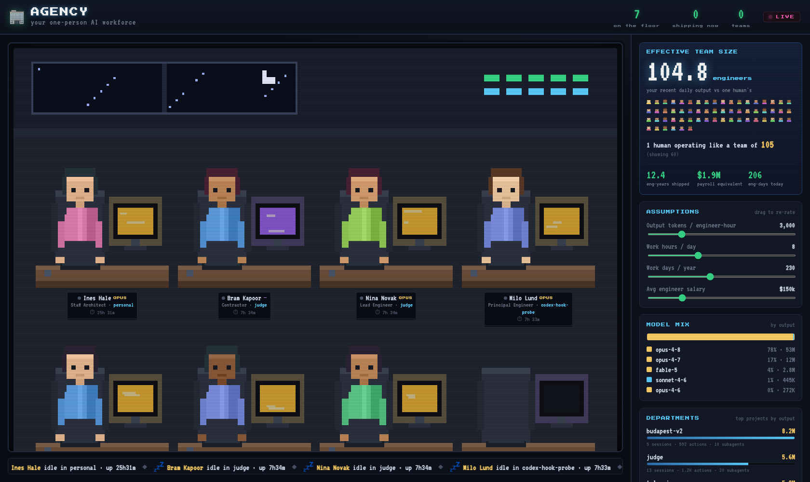

# 🏢 Agency

A live pixel-art office sim of your Claude Code, Codex, and opencode workforce.

You're a one-person startup — but your AI coding agents do the work of *many*.
Agency reads your **real, local** Claude Code data (from `~/.claude/`),
Codex data (from `~/.codex/`), and opencode data (from `~/.local/share/opencode/`) and visualizes it as a tiny
retro office: every running session is a pixel worker at a desk (typing
when busy, monitor glowing by model tier), and your token throughput gets
translated into **manpower** — effective team size, engineer-years shipped, and
the payroll you'd be paying humans to match it.

Nothing leaves your machine — unless you explicitly opt into the [leaderboard](#leaderboard-opt-in). No dependencies.



## Run it

```bash
npx @henryz2004/agency
# → opens http://localhost:4313 in your browser
```

That's it — no install, no build, no dependencies. (From a checkout, `node server.js`
does the same.) Set a different port with `PORT=8080`, and `AGENCY_NO_OPEN=1` to skip
auto-opening the browser. State (your roster + usage cache) lives in `~/.agency`.

Leave it open on a second monitor and start some `claude`, `codex`, or
`opencode` sessions — workers appear at desks within ~3 seconds, busy ones
start typing, and uptimes tick live.

## What it shows

**The floor** — one desk per *running* session (Claude Code, Codex, or opencode), discovered from
`~/.claude/sessions/<pid>.json` (validated against live PIDs), `~/.codex/process_manager/chat_processes.json` joined with `~/.codex/state_5.sqlite`, or the opencode SQLite database. Each agent gets:
- a stable name + job title (Intern → Principal, keyed to its model tier),
- a glowing monitor colored by model (Opus = gold, Sonnet = cyan, Haiku = green),
- a "typing" animation while `busy`, and a live uptime counter.

Co-located agents (same project) cluster together on a shared **team rug**
labeled with the repo name, so you read the floor as teams, not a scattered grid.

**Effective team size** — your recent daily output tokens divided by what one
human engineer would produce. Drag the **Assumptions** sliders (tokens per
engineer-hour, hours/day, days/year, salary) to re-rate everything instantly:
- *engineer-years shipped* (lifetime output),
- *payroll equivalent* (what the humans would cost),
- *engineer-days today*.

**Comparison** — a row of pixel people: you (gold) vs. the team you operate like.

**Panels** — model mix by output, top "departments" (projects) by output, a
30-day daily-output chart, and an all-time ledger (tokens, tool actions,
subagents hired, sessions, active days).

## Walk the floor

Press **`g`** (or click the walk button) to drop in a controllable **player
character**. Drive it with **WASD / arrows**; the camera follows you. Walk up to
a desk and that agent's chat surfaces in the peek panel (it reuses the same
selection event a click does), so you can wander the floor and read what each
agent is doing. Press `g` again to return to free pan/zoom. A cat roams the
lounge for company.

## How it works

Zero dependencies — just Node's `http` + `fs` and a vanilla-JS canvas frontend.

| File | Role |
|------|------|
| `server.js` | HTTP server; single `/api/state` endpoint fusing live + usage |
| `lib/live.js` | running sessions, uptime, status, per-session model |
| `lib/usage.js` | parses `~/.claude/projects/**/*.jsonl` plus Codex/opencode usage, cached by mtime+size |
| `lib/opencode.js` | reads opencode SQLite DB for live sessions + usage stats |
| `lib/codex.js` | reads Codex local state for live sessions + usage stats |
| `lib/roster.js` | stable name/title/palette per session (persisted) |
| `public/office.js` | the pixel office: project desk clusters, team rugs, decor, camera, animation |
| `public/sprites.js` | procedural pixel-art drawing (every glyph; no sprite sheet) |
| `public/avatar.js` | the walkable user avatar + wandering cat (`g` to toggle, WASD/arrows) |
| `public/app.js` | data polling, manpower math, panels, ticker |

Usage stats are cached in `~/.agency/usage-cache.json` and `~/.agency/opencode-usage-cache.json`
(only changed transcripts/DB state are re-parsed on refresh; the main cache now includes Claude, Codex, and opencode usage); agent identities persist in `~/.agency/roster.json`. Override the location with `AGENCY_DATA_DIR`.

Codex live sessions come from `~/.codex/process_manager/chat_processes.json`
and `~/.codex/state_5.sqlite`.

> The manpower numbers are a deliberately fun heuristic, not a benchmark — they
> exist to make a one-person shop *feel like more*. Tune the sliders to taste.

## Leaderboard (opt-in)

Agency ships with an **optional** public leaderboard that ranks installs by
*standardized engineer-years* — the same eng-years figure as the personal card,
but with the assumption sliders **frozen to fixed constants** so everyone's
number is comparable (and not gameable by tuning your own dials).

It is **off by default and opt-in**. Nothing is uploaded until you open the 🏆
panel and click *Join*, and even then the only data sent is **a display name and
your standardized eng-years number** — never your code, transcripts, repo names,
or project names. *Stop sharing* deletes your row.

The backend is a tiny Cloudflare Worker + D1 database under [`worker/`](worker/) —
see [`worker/README.md`](worker/README.md) to deploy your own and point the
dashboard at it (set `LEADERBOARD_API` in `public/leaderboard.js`). Until that
URL is set, the leaderboard UI stays hidden and Agency runs exactly as before.
